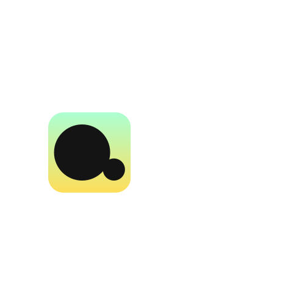

<h1 align="center">
    <br>
</h1>

<div align="center">
<i style="display: block; font-style: italic; font-size:15px;">dwin: Is a CLI for 
<a href="https://render.com/">Render Cloud.</a> 🚀</i>
</div>

## Details 🚀

Welcome to `dwin`! is a powerful tool designed to centralize and manage environment variables across various stages and environments in development workflows. Built with a focus on backend frameworks, **dwin** allows development teams to synchronize, secure, and manage environment configurations effectively, improving both consistency and security across multiple environments (e.g., development, staging, production).

## Table of Contents

- [Details 🚀](#details-)
- [Table of Contents](#table-of-contents)
- [Features](#features)
- [Installation](#installation)
- [Getting Started](#getting-started)
- [Usage](#usage)
  - [Setting Variables](#setting-variables)
  - [Retrieving Variables in Your Backend](#retrieving-variables-in-your-backend)
    - [Django Example (`settings.py`)](#django-example-settingspy)
    - [Flask Example (`config.py`)](#flask-example-configpy)
- [Configuration](#configuration)
  - [Config File](#config-file)
  - [Environment-Specific Configurations](#environment-specific-configurations)
- [Examples](#examples)
  - [Synchronizing Variables Across Stages](#synchronizing-variables-across-stages)
  - [Accessing Variables via CLI](#accessing-variables-via-cli)
- [Security](#security)
- [Contribution](#contribution)
- [License](#license)

---

## Features

- **Centralized Management**: Manage all environment variables in one place, accessible to all developers.
- **Multiple Stages and Environments**: Support for development, staging, production, and custom environments.
- **Secure Storage and Retrieval**: Keep sensitive variables safe with built-in encryption and access control.
- **Cloud Sync**: Sync local and cloud configurations to maintain up-to-date environment variables.
- **History & Rollback**: Version control for environment variables with backup and rollback functionality.

## Installation

```bash
pip install dwin
```

> **Requirements**: Ensure you have Python 3.8 or above and your backend framework (e.g., Django, Flask, Express) installed.

## Getting Started

1. **Initialize dwin**:
   In your project root, initialize `dwin` to set up your environment configuration.

   ```bash
   dwin init
   ```

2. **Connect dwin to Cloud (optional)**:
   Enable cloud sync if you wish to keep your configurations updated across devices and teams.

   ```bash
   dwin sync --enable
   ```

## Usage

### Setting Variables

Add environment variables for specific stages:

```bash
dwin set API_URL "https://api-dev.example.com" --env=development
dwin set API_URL "https://api-prod.example.com" --env=production
```

### Retrieving Variables in Your Backend

#### Django Example (`settings.py`)

```python
import dwin

# Initialize dwin
dwin.init(project_name="my_project", environment="development")

# Retrieve variables
SECRET_KEY = dwin.get("SECRET_KEY", default="default_secret")
DATABASES = {
    'default': {
        'ENGINE': 'django.db.backends.postgresql',
        'NAME': dwin.get("DB_NAME", default="my_db"),
        'USER': dwin.get("DB_USER", default="user"),
        'PASSWORD': dwin.get("DB_PASSWORD", default="password"),
        'HOST': dwin.get("DB_HOST", default="localhost"),
        'PORT': dwin.get("DB_PORT", default="5432"),
    }
}
```

#### Flask Example (`config.py`)

```python
import dwin

# Initialize dwin
dwin.init(project_name="my_project", environment="development")

# Access environment variables
SQLALCHEMY_DATABASE_URI = dwin.get("DATABASE_URL", default="sqlite:///my_local_db.sqlite3")
```

## Configuration

### Config File

Optionally, create a `.dwinconfig` file in your project root to configure settings like:

```yaml
project_name: my_project
default_environment: development
cloud_sync: true
```

### Environment-Specific Configurations

Each environment can have unique configurations, which can be accessed and modified through the CLI or `dwin`'s API.

## Examples

### Synchronizing Variables Across Stages

```bash
# Sync all local variables to the cloud
dwin sync --to=cloud

# Sync variables from the cloud to your local environment
dwin sync --from=cloud
```

### Accessing Variables via CLI

```bash
# List all variables
dwin list --env=production

# Remove a variable
dwin remove API_URL --env=development
```

## Security

**dwin** takes security seriously, providing:
- **Encrypted storage** of sensitive environment variables.
- **Access control** with roles and permissions to restrict access based on user roles.
- **Backup and Versioning**: Ability to restore previous versions of configurations, minimizing risk from accidental changes.

## Contribution

Contributions are welcome! Please follow these steps to contribute:
1. Fork the repository.
2. Create a new branch (`feature/my-feature`).
3. Commit changes.
4. Open a pull request.

Please refer to our [CONTRIBUTING.md](CONTRIBUTING.md) for more details.

## License

This project is licensed under the MIT License. See the [LICENSE](LICENSE) file for more information.